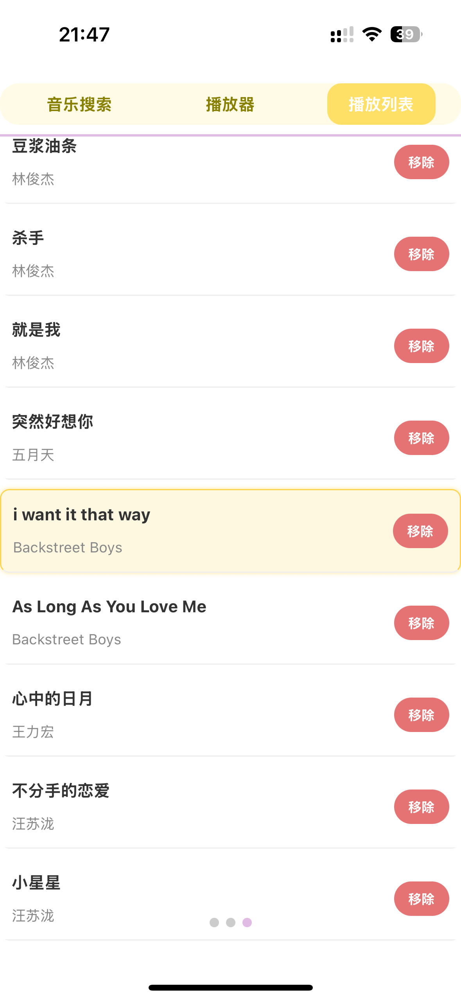
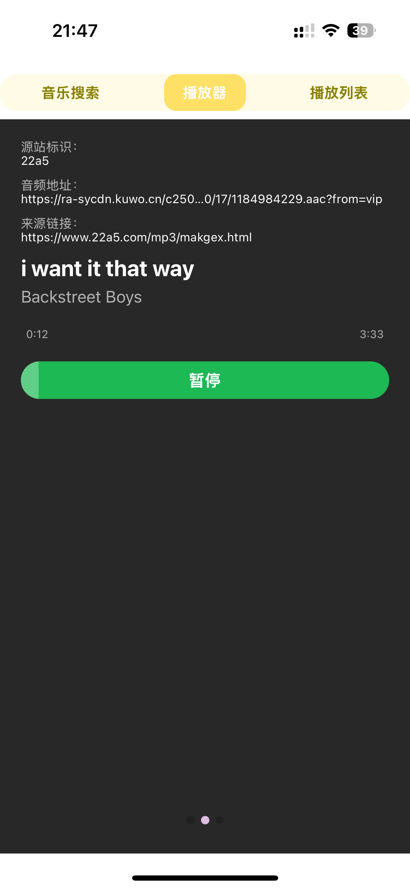

# SmartSign

存储及展示书签的新方式

### 🎯 软件目标

将访问过的网页中链接，存储成书签的同时，通过后处理，整理成音乐播放器，视频播放器，电台，电子书。

---

### 📓 发布日志

v1.0.0【2025.07.25】

- [1] 访问三方音乐网站并保存听歌历史
- [2] 将歌曲历史做成音乐播放器
- [3] 因为音乐地址时间长了会失效，遂给播放器添加自动更新功能

---

### 🎖 功能展示

- 🎵 音乐播放器

  
  
  

- 🎬 视频播放器 （计划中）

- 🎧 电台（计划中）

- 📖 电子书（计划中）

---

### 🔗 友情链接

- 小程序

  
  
  
